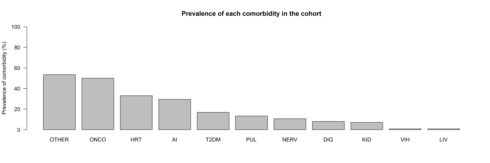
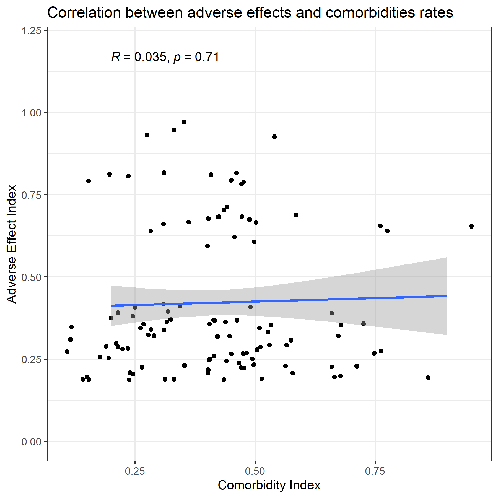
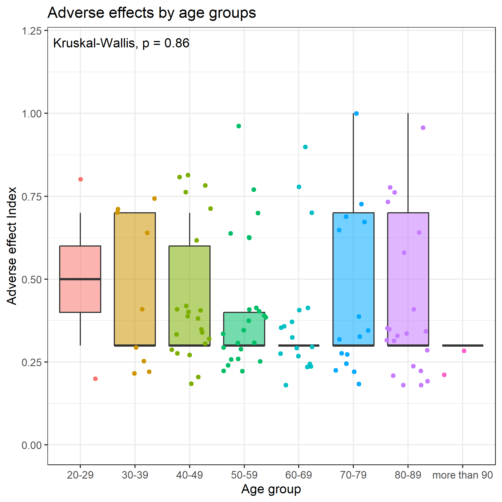
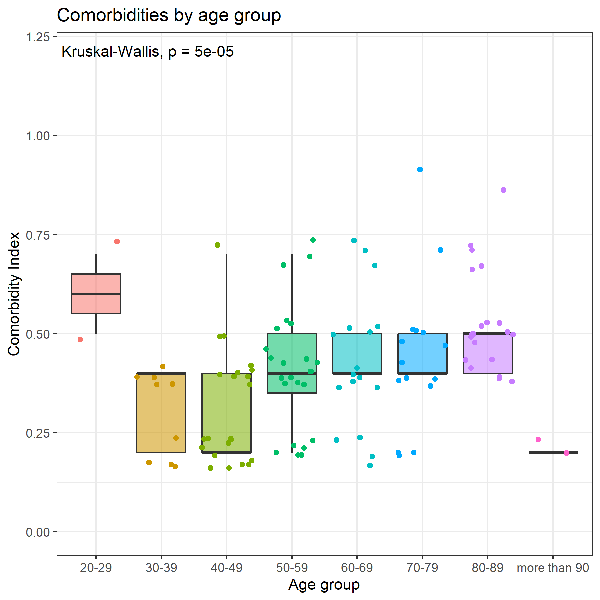
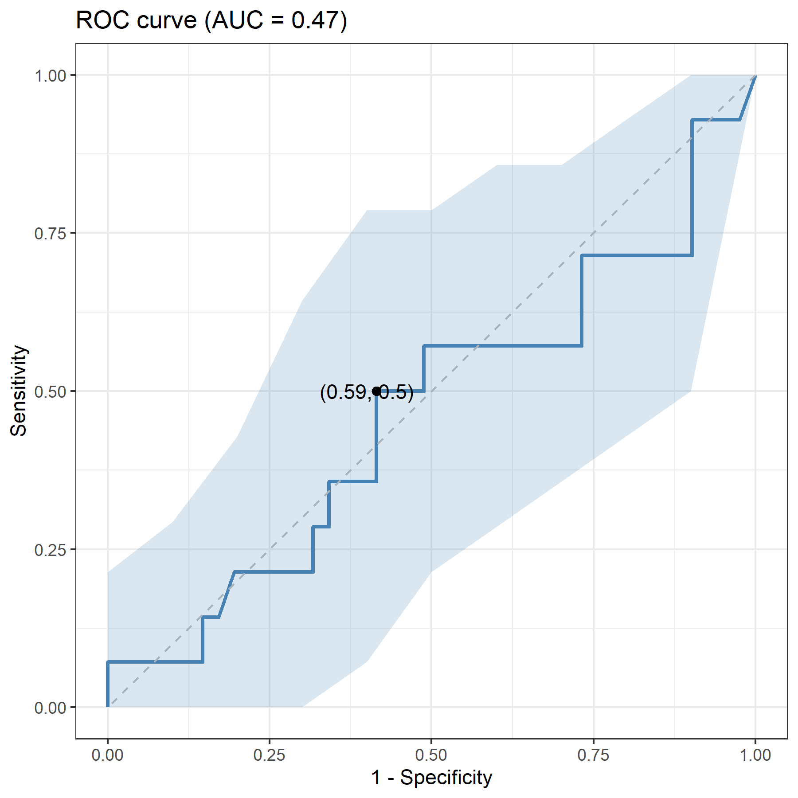
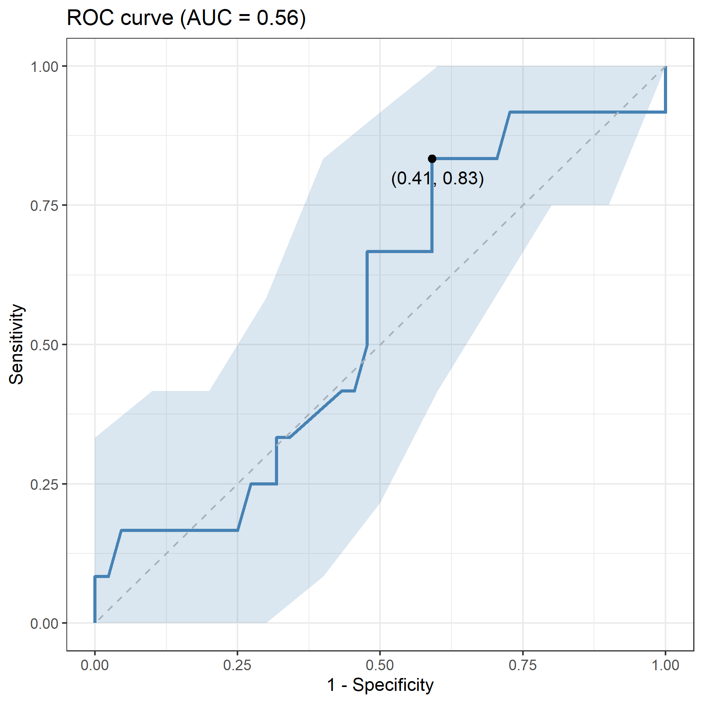

# Paxlovid Patient Cohort Analysis

## Overview

This repository contains the code and data for analyzing a cohort of patients administered Paxlovid. The analysis focuses on understanding the effects and outcomes of Paxlovid treatment using various statistical and computational methods in R.

## Table of Contents

- [Introduction](#introduction)
- [Data](#data)
- [Analysis](#analysis)
- [Results](#results)
- [Conclusion](#conclusion)
- [Limitations](#limitations)

## Introduction

Paxlovid is an antiviral medication used to treat COVID-19. This project aims to analyze the efficacy and safety of Paxlovid using a cohort of patients. The analyses performed include:

1. **Exploratory Analysis**: Analyze the prevalence of different comorbidities present in the cohort and the adverse effects detected in each patient.

2. **Calculation of Adverse Effect Index and Comorbidity Index**: Both indices are calculated by dividing the number of adverse effects or comorbidities that a patient has by the total number of comorbidities or adverse effects in the study. Adverse effects/comorbidities are recorded as presence/absence (1/0), so the indices are a discrete measure between 0 and 1. These indices are studied to understand their distribution across genders and different age groups.

3. **Prediction of Nervous Adverse Effect from Comorbidities**: Finally, the study investigates whether the occurrence of nervous adverse effects (the most common adverse effect in the cohort) can be predicted from the comorbidities that a patient has. Three different algorithms are used for this prediction: Lasso/Logistic Regression, Random Forest, and XGBoost.

## Data

### Data Source

The data used in this project is sourced from [Data Source Name/Provider]. The dataset includes the following information:

- Patient demographics (age, gender, etc.)
- Clinical data (pre-existing conditions, severity of illness, etc.)
- Treatment details (dosage, duration, etc.)
- Adverse effects recorded during and after treatment

## Analysis

### 1. Exploratory Analysis

The exploratory analysis focuses on:

- Prevalence of different comorbidities present in the cohort

    #### Explanation Comorbidities
    - **HRT**: Cardiac comorbidities
    - **ONCO**: Oncological comorbidities
    - **PUL**: Pulmonary comorbidities
    - **AI**: Autoimmune comorbidities
    - **T2DM**: Type 2 diabetes comorbidities
    - **NERV**: Nervous system comorbidities
    - **VIH**: HIV comorbidities
    - **LIV**: Hepatic comorbidities
    - **DIG**: Digestive comorbidities
    - **KID**: Renal comorbidities
    - **OTHER**: Other comorbidities

- Adverse effects detected in each patient

    #### Explanation of Abbreviations
    - **HEP**: Hepatic adverse effects
    - **NER**: Nervous adverse effects
    - **REN**: Renal adverse effects
    - **DIG**: Digestive adverse effects
    - **HRT**: Cardiac adverse effects
    - **OTHERS**: Other adverse effects

### 2. Calculation of Adverse Effect Index and Comorbidity Index

The indices are calculated as follows:

- **Adverse Effect Index (AEI)**: 

$$
AEI = \frac{\text{Number of adverse effects a patient has}}{\text{Total number of adverse events reported in the study}}
$$

- **Comorbidity Index (CI)**: 

$$
CI = \frac{\text{Number of comorbidities a patient has}}{\text{Total number of comorbidities reported in the study}}
$$

Both indices are discrete measures between 0 and 1, recorded as absence/presence (0/1).

These indices are analyzed to understand their distribution across genders and different age groups.

     
    

     
    

### 3. Prediction of Nervous Adverse Effect from Comorbidities

This analysis investigates whether the occurrence of nervous adverse effects can be predicted from the comorbidities that a patient has. The following algorithms are used:

- ### Logistic Regression

- ### Random Forest

- ### XGBoost

The logistic regression model with L1 regularisation (lasso) was shown to have the highest predictive power. However, the performance was very low in all of them. Although in the lasso model the 1-specificity (FPR) is not entirely bad, in skewed distributions and diagnostic models the sensitivity (TPR) should be prioritised. In this case the lasso model's ability to avoid false negatives is too low, bordering on the predictive ability of a random classifier.

## Conclusion
No statistically significant results were obtained in any of the analyses performed on this cohort. The adverse effects developed after paxlovid administration by the patients do not seem to be related to their previous comorbidities. For this reason, other factors not included in the study could be the cause of their occurrence.

## Limitations

The limited size of the cohort coupled with the heterogeneity of the cohort are the main limitations of the study. The lack of sufficiently large groups of similar age and with a more homogeneous clinical picture are some of the possible reasons why no significant differences were observed and the models showed poor accuracy in predicting which patients might or might not develop adverse effects of a nervous nature.

## License

This project is licensed under the MIT License. See the [LICENSE](LICENSE.GPL) file for details.